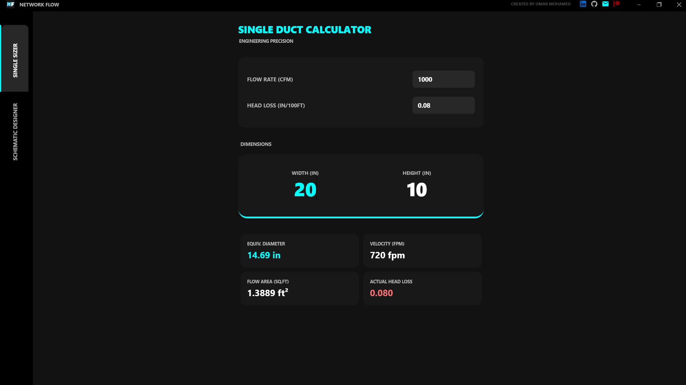
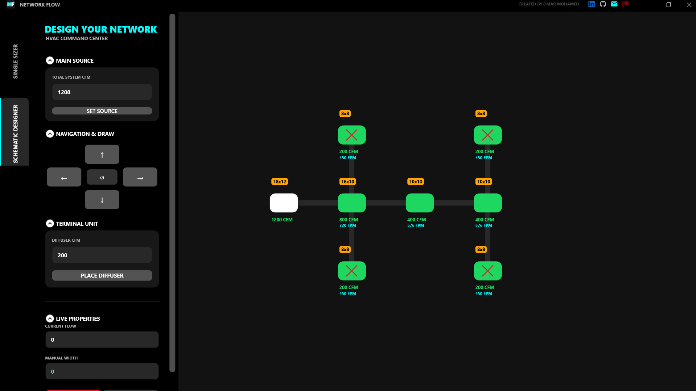
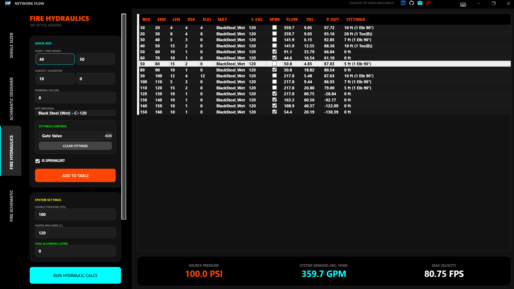
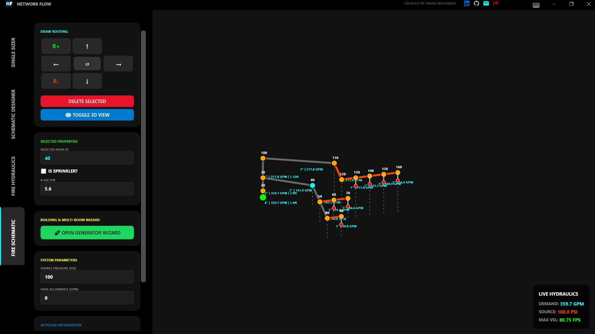

# 🌊 NETWORK FLOW | Master Suite

**NETWORK FLOW** is a professional desktop application designed for HVAC engineers to calculate duct sizing and design schematic networks with high precision. Built with a focus on efficiency, it features a modern, dark-themed UI inspired by industry-standard software.

## 🚀 Overview

#Update v1.0.0

## 🚀 Key Features

* **Duct Sizing (Single Sizer):** Accurate calculations based on the Equal Friction Method (McQuay standards).
* **Schematic Designer:** Interactive canvas for building and visualizing complex duct networks.
* **Automatic Sizing:** Smart logic to round dimensions up to the nearest even integer (e.g., 8x8, 10x8).
* **Real-time Monitoring:** Visual feedback for system overloads (Warning Labels) and velocity checks (FPM).
* **Custom UI:** Modern dark mode interface with intuitive controls and professional branding.

## ⌨️ Keyboard Shortcuts

Speed up your design process with these integrated shortcuts:

| Action | Shortcut |
| :--- | :--- |
| **Navigate Nodes** | `Arrow Keys` (Up, Down, Left, Right) |
| **Add New Duct** | `Ctrl + Arrow Keys` |
| **Add Diffuser** | `Ctrl + D` |
| **Undo Last Action** | `Ctrl + Z` |
| **Delete Selected** | `Delete Key` |

## 🛠️ Tech Stack

* **Language:** C#, C++, and Python.
* **Framework:** .NET / WPF (Windows Presentation Foundation)
* **Styling:** Custom XAML with Vector-based icons.

## 📈 Project Impact
* **Automation:** Streamlines the repetitive task of duct sizing.
* **Accuracy:** Minimizes human error in calculating dimensions and velocity.
* **Efficiency:** Reduces the time taken to produce technical documentation for large-scale projects.

Update v1.0
 Fire Fighting Module Update 🔥🚀

Does fire protection design take days of your time? The development journey of **Network Flow** continues, and today we are taking fire fighting network design to a whole new level! 🔥🚀

Driven by feedback from fellow engineers, the latest update for **Network Flow** focuses entirely on automating and accelerating fire fighting network design. This allows engineers to focus on critical engineering decisions while the software handles the repetitive tasks.

### Key Updates in the Fire Fighting Module:

#### 🏗️ NFPA 13 Wizard Builder
Imagine building an entire building network (risers, branch lines, and sprinklers) with a single click! This tool automatically distributes sprinklers based on **Hazard Classification** and area constraints, providing real-time engineering alerts if the maximum allowable sprinkler coverage per code is exceeded.

#### 💧 Ultra-Precise Hydraulic Engine
Real-time path tracing, precise calculation of source pressure, friction losses (using the **Hazen-Williams** formula), and water velocities. The software performs full hydraulic balancing and generates comprehensive reports and Bills of Quantities (BOQ) with a single click.

#### ⚡ "Power User" Environment (Shortcuts & Multi-Edit)
Say goodbye to tedious mouse drafting! You can now sketch the entire network, add valves (Gate, Check, Alarm), and convert points to sprinklers using keyboard shortcuts (`CTRL + Arrows`). It also features a **Multi-Edit** capability to modify the diameters and properties of dozens of pipes simultaneously.

#### 📐 True 3D CAD Export
Done with design and calculations? With one click, the software generates an intelligent **AutoLISP** script that completely models the network in 3D inside AutoCAD, utilizing real-world coordinates and elevations automatically!

---
## 🚧 Upcoming Features (Roadmap)
- [ ] Integration of a master equipment database (Carrier, Daikin, LG, Sharp).
- [ ] Direct export/integration with AutoCAD and Revit plugins.
- [ ] Static Pressure Loss calculation module.

## 👤 Author

**Omar Mohamed Salama**
*AutoCAD Design Engineer & Data Scientist*

---
*Designed for engineers who value precision and speed.*
